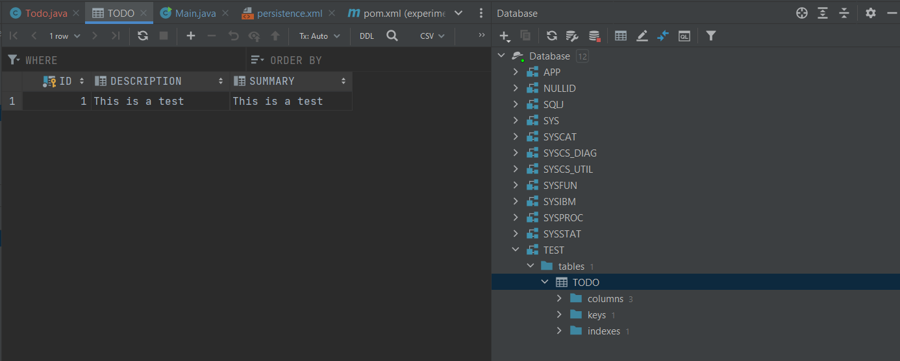
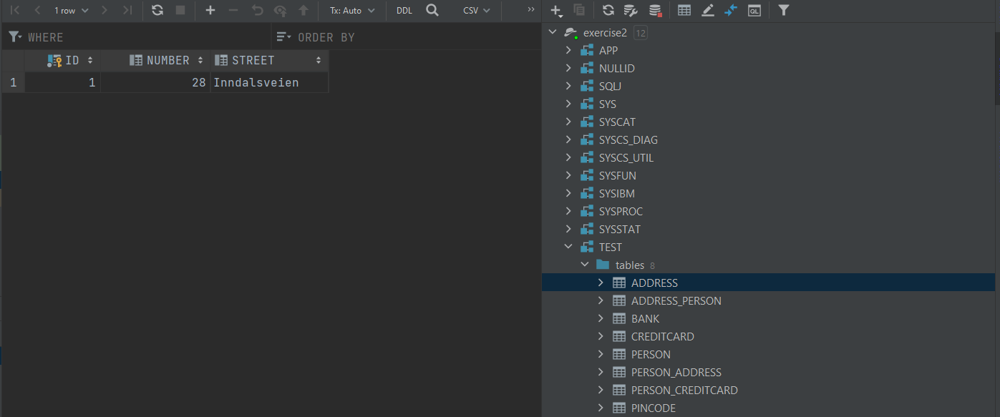
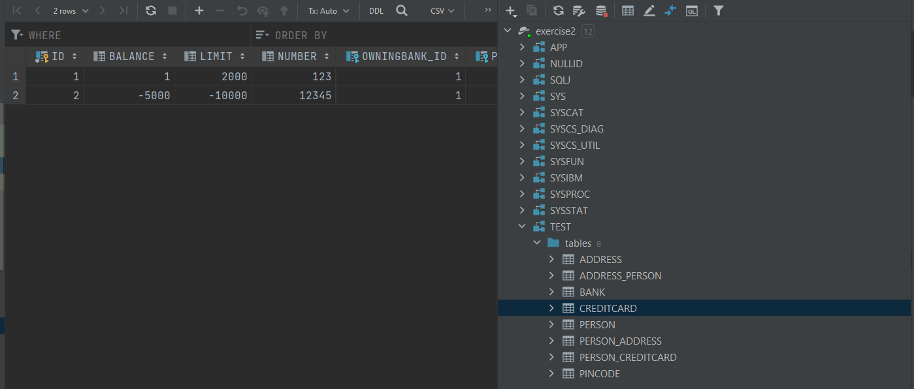
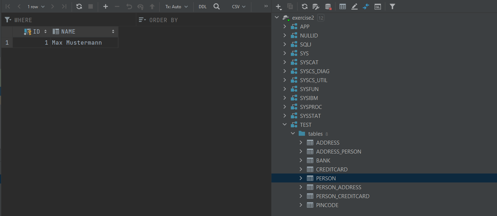
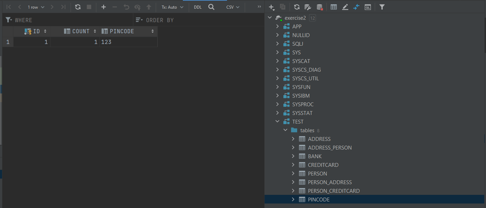
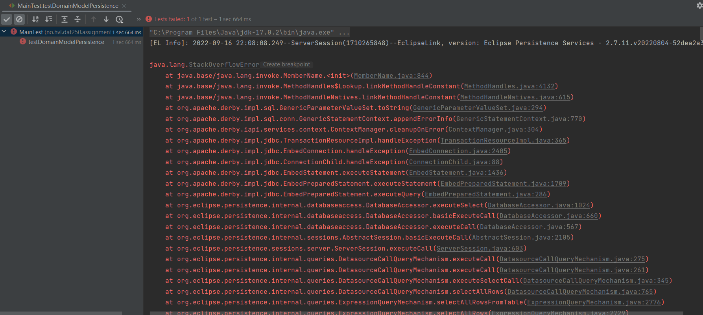

# Erlend Skutlaberg

## Technical problems
I encountered a couple of problems. First problem was that the new versions of the eclipselink folder didn't contain the jars  
needed for this exercise. Secondly, i had problems with erors because my database was open in the database inspector in Intellij.  

## Link to experiment 2
https://github.com/Skutlis/JPA-tutorial/tree/main/dat250-jpa-example-master/eclipselink/experiment-2

## Inspection
I inspected the tables with the Database extension in Intellij ultimate edition. This was done by linking the path and logging  
in with the credentials defined in the percistence.xml file.  

### Databases from exercise2:  

## Pending issues
I didn't get the test to run properly at the end(they did run at some point) due to an error i can't understand:

And about 90 more lines of exceptions..  
Everything is in the database, so i don't really understand this problem.

## UPDATE
I used getters and setters instead of @Data, and now the tests passes without any errors!
